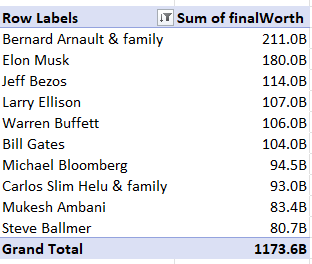

# Billionaires Data Analysis using Excel

Exploratory data analysis on world's billionaires list of 2024

## Overview

In this case study, we delve into the 2024 billionaire list, providing a comprehensive data analysis of the world's wealthiest individuals. The analysis focuses on key aspects of the billionaires, such as their **net worth**, the **countries they originate from**, and the **industries** that contributed to their current wealth. Furthermore, it examines the **age** distribution among the billionaires and explores the paths they took to reach their current status, whether through entrepreneurship, inheritance, or other means. 

This analysis aims to uncover patterns and trends shaping global wealth distribution in 2024.

## Tools

Excel
  - Excel Table Format
  - Pivot tables
  - Pivot Measures
  - Basic excel functions
      - Date - concatenation of cells formatted as date type
      - Yearfrac - date difference
      - Concatenation
  - Graph / Chart Visualisation
  - Data Analysis built-in function
  - Filter Slicer

## Exploratory Data Analysis

### Dashboard
For interactive dashboard, open excel file and go to dashboard worksheet or to download the file click [here](Billionaires_Dataset.xlsx)

### Data Preparation
  - Converting the data from Data Worksheet to excel table format
  - Initial descriptive statistics summary before cleaning the data
  
    
  - Correlation of Billionaires between Country's population
  - Correlation of Billionaires between Country's GDP

### Data Cleaning
  - Remove unnecessary columns
  - Remove duplicates
  - Removing and replacing unnecessary chars

### Data Transformation
  - Create column for Birthdate
  - Create column for Age
  - Create Name column combinging firstname and lastname
  - Date and currency formatting

### Analysis using Pivot Tables
  - Top 10 Richest per Category / Country / Gender / Self made
  
  
  
  - Number of Billionaires per country

  
  
  - Age bracket of Billionaire (10 year bin)

  
  
  - Category / industries

  
  
  - Slicer / Filter of Category, country, gender, self made
  
  

### Visualisation
  - Top 10 Richest - Bar Graph
  - Country -  Map Graph
  - Age bracket - Column Chart
  - Gender (Male v Female ratio) - Doughnut Chart
  - Self made ( True / False ratio) - Doughnut Chart
  - Visual card - Total number of Billionaires
  - Slicer / Filter (Country, Category, Gender, Self-made)
  - Category

# Data Insights
  - Total of 475 billionaires from 2024 with atleast 5 billion worth, 86% (407) are male compared to 14% (68) female.
  - Out of 475, 309 (65%) of them are self made billionaires or started their company on their own and reached the billionaire status as of 2024. 166 (35%) of them are not self made billionaire.
  - Finance and Investments industry have the most number of billionaires with total of 77, followed by Technology, 62 and Fashion and Retail 54.
  - Most of billionaires come from 60-70 (130) aged bracket, followed by 70-80 (115)
  - USA had the most number of billionaires with 190 followed by China, 73. Noticeably, region of Africa had only 3 and Europe had the most number of billionaires.

